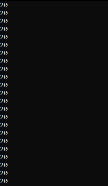
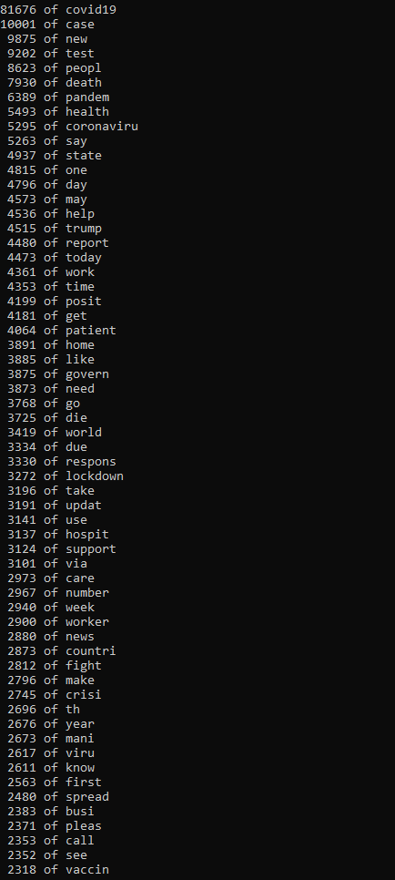
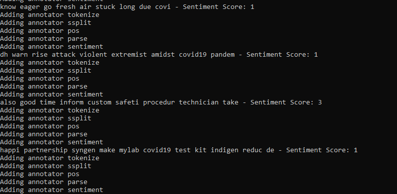

**TweetInsight** Is a java based tool that analyzes sentiment in tweets related to the COVID-19 pandemic.

## Features
- Sentiment analysis of tweets using Stanford NLP
- Word frequency calculation
- CSV parsing for specific tweet data
- Temporal filtering of tweets

## Technologies Used
- Java
- Stanford NLP
- SimpleDateFormater for date parsing
- BufferedReader for various file operations

## Installation

1. **Clone the repository:**
   ```bash
   git clone https://github.com/tylerc122/TweetInsight.git
   cd TweetInsight
2. **Make sure you have JDK (Java Development Kit) installed:**
    If you don't happen to have it installed, you can find the download [here](https://www.oracle.com/java/technologies/downloads/)
3. **Install Stanford Core NLP:**
    Install the zip folder [here](https://nlp.stanford.edu/software/stanford-corenlp-full-2018-10-05.zip)
4. **Extract needed files:**
    
    From the zip folder, you only need one file:
    ```bash
    stanford-corenlp-3.9.2.jar
    ```
    The second & third file you will need can be found [here](https://repo1.maven.org/maven2/com/googlecode/efficient-java-matrix-library/ejml/0.23/ejml-0.23.jar) and [here](https://nlp.stanford.edu/software/stanford-english-corenlp-2018-10-05-models.jar)
5. **Create new folder for dependencies:**
    - In TweetInsight folder, create a new folder 'lib' or 'dependencies'
    - Place the three jar files in it
6. **Compile the project:**
    
    If you named your dependencies folder **'lib'**
    
    - **MacOS/Linux:**
        ```bash
        javac -cp "lib/*:." -d . src/*.java
        ```
    - **Windows:**
        ```bash
        javac -cp "lib/*;." -d . src/*.java
        ```
    If you named your dependencied folder **'dependencies'**

    - **MacOS/Linux:**
        ```bash
        javac -cp "dependencies/*:." -d . src/*.java
        ```
    - **Windows:**
        ```bash
        javac -cp "dependencies/*;." -d . src/*.java
        ```
7. **Run the project:**

    - **MacOS/Linux:**

        ```bash
        java -cp "lib/*:." src.Driver
        ```

    - **Windows:**
        ```bash
        java -cp "lib/*;." src.Driver
        ```

Your output should look something like this:

- First you'll see various numbers printed out, these signify the day each tweet in the data set was posted:

    

- The next unique output should be the top words in the tweets in the specified temporal range, the default range is from March 20 2020 - January 15 2021. 

    

    You can change the range of dates in Driver.java for different results.

- Lastly, you'll see each tweet displayed with its corresponding sentiment analysis score based on the words in the tweet:

    
